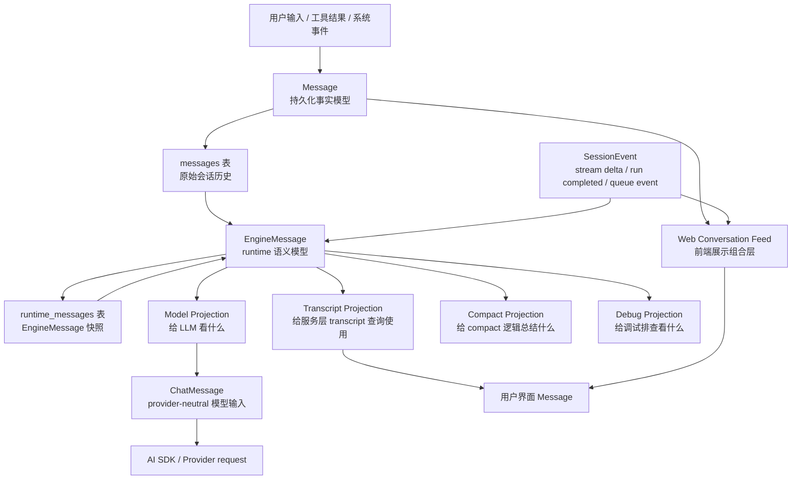

# 消息投影

OpenAgentHarness 的消息系统不是单层的“聊天记录”。同一段对话在不同地方有不同用途：

- 数据库需要保存完整事实。
- Engine 需要理解每条消息的运行时语义。
- LLM 只能看到经过裁剪、压缩、补充后的上下文。
- UI 需要展示用户能理解的对话过程。
- Debug/trace 需要反查某条模型输入来自哪些原始消息。

所以当前消息主链路是：

```txt
Message -> EngineMessage -> ProjectedMessage -> ChatMessage -> Provider/AI SDK Message
```

最重要的心智模型：

```txt
Message          记录事实
EngineMessage    解释运行时语义
Projection       选择某个消费目标需要看到的视图
ChatMessage      变成模型输入格式
UI Message       变成用户界面可展示的对话条目
```

## 总览图



注意：`EngineMessage` 是代码里的 runtime 语义对象；`runtime_messages` 是数据库表，用来保存 `EngineMessage[]` 的快照。二者不是同一层概念。

## 五层边界

| 层 | 代码类型/存储 | 主要问题 | 不负责什么 |
| --- | --- | --- | --- |
| Persisted Message | `Message`, `messages` 表 | 发生了什么，如何通过 API 返回 | 不直接决定模型上下文 |
| Engine Message | `EngineMessage`, `runtime_messages.payload` | 这条消息在 runtime 中是什么语义 | 不直接适配 provider 格式 |
| Projected Message | `TranscriptMessage`, `ModelMessage`, `CompactMessage`, `DebugMessage` | 某个消费目标应该看到什么 | 不保存原始事实 |
| Chat Message | `ChatMessage` | provider-neutral 的 role/content 模型输入 | 不做 compact 决策 |
| Provider Message | AI SDK / provider request message | 满足具体 SDK 或模型网关格式 | 不表达 OAH 内部语义 |

## 阅读路径

1. [Message 与 EngineMessage](./message-and-engine-message/): 解释 `Message`、`EngineMessage`、`runtime_messages` 的关系，以及 `Message -> EngineMessage` 的提升规则。
2. [Projection 实现细节](./projection-implementations/): 逐个解释 `Model`、`Transcript`、`Compact`、`Debug` projection 的实现细节。
3. [模型输入与 UI 展示](./model-and-ui-mapping/): 解释 `ModelMessage -> ChatMessage -> LLM request`，以及当前 Web UI 的展示映射。

## 映射总表

| 源 | 转换 | 目标 | 主要代码 |
| --- | --- | --- | --- |
| `Message[]` | `toEngineMessages()` | `EngineMessage[]` | `engine-messages.ts` |
| `Message[] + SessionEvent[]` | `buildSessionEngineMessages()` | `EngineMessage[]` | `engine-messages.ts` |
| `EngineMessage[]` | `replaceBySessionId()` | `runtime_messages` | storage repositories |
| `runtime_messages` | `listBySessionId()` | `EngineMessage[]` | storage repositories |
| `EngineMessage[]` | `projectToTranscript()` | `TranscriptMessage[]` | `message-projections.ts` |
| `TranscriptMessage[]` | `#toTranscriptMessage()` | API `Message[]` | `session-engine.ts` |
| `Message[] + events + live` | `buildProjectedMessageFeed()` | UI `Message[]` | `engine-view-model.ts` |
| `EngineMessage[]` | `projectToModel()` | `ModelMessage[]` | `message-projections.ts` |
| `ModelMessage[]` | `toAiSdkMessages()` | `ChatMessage[]` | `ai-sdk-message-serializer.ts` |
| `ChatMessage[]` | provider adapter | AI SDK/provider request | `model-runtime` |
| `EngineMessage[]` | `projectToCompact()` | `CompactMessage[]` | `message-projections.ts` |
| `EngineMessage[]` | `projectToDebug()` | `DebugMessage[]` | `message-projections.ts` |

## 最容易混淆的点

### `Message` 和 `EngineMessage` 是否可以合并？

不建议。

`Message` 是稳定 API/存储合同。`EngineMessage` 是 runtime 解释层。合并会导致：

- API 暴露过多 engine 内部概念。
- runtime kind 演进变成存储/API 迁移。
- projection 逻辑被迫到处解析 metadata。
- compact/resume/handoff 等能力难以继续演进。

### `EngineMessage` 和 `runtime_messages` 是不是一回事？

不是。

```txt
EngineMessage 是对象。
runtime_messages 是保存对象快照的表。
```

### `ModelMessage` 是不是最终发给 LLM 的消息？

不是。

`ModelMessage` 只是 model projection 的输出。它还要经过 serializer、hooks、static prompts、system reminder、provider adapter。

### UI 展示是不是等于 model projection？

不是。

UI 展示要保留用户可理解的过程；model projection 要控制上下文窗口、compact、tool result pruning。两者目标不同。

### compact 是否删除历史？

不应该理解成删除历史。

compact 在模型视图中裁剪旧历史，并用 `compact_summary` 承接上下文。原始 `Message` 和 transcript/debug 仍然可以保留完整过程。

## 设计原则

1. 任何会被 projection、compact、resume、handoff 依赖的语义，都应该进入 `EngineMessage.kind`。
2. 只属于 UI hint、审计、调试的附加信息，可以留在 metadata。
3. Projection 输入尽量只读 `EngineMessage`，不要重复猜 persisted metadata。
4. `projectToModel()` 决定“给模型看什么”。
5. Serializer 只决定“如何把 model projection 表示成 ChatMessage”。
6. Provider adapter 只决定“如何满足具体 SDK 或 provider 的格式”。
7. UI transcript 和 model context 不要混用同一个视图。

